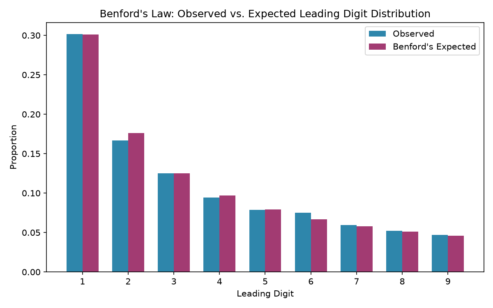

# Journal Entry Anomaly Detector

This is a Python tool that runs standard audit analytical procedures on a real government payment dataset: the Texas Education Agency's Check Register for FY2025. It covers 61,775 transactions paid out to school districts and vendors across the state.

Applied to this dataset, it flagged seven high-priority duplicate payment pairs worth follow-up, including a $1,249,104.08 payment to Texas Tech University that repeated within six days.

## What it does

The script runs four checks that auditors actually use when reviewing a set of transactions:

| Check | What it flags | Why it matters |
|---|---|---|
| **Duplicate payment detection** | Same vendor, same amount, paid within 7 days | The classic test for double payments |
| **Round dollar analysis** | Payments landing on suspiciously round numbers, like $5,000 or $10,000 | Real invoiced amounts are almost never that clean, so round numbers can point to estimates or manual overrides instead of actual invoices |
| **Weekend posting check** | Transactions dated on a Saturday or Sunday | Unusual for normal payment processing, can point to entries made outside standard controls |
| **Benford's Law** | Statistical deviation in the leading digit of every dollar amount | Naturally occurring financial data follows a predictable digit pattern; big deviations can be worth a second look |

## What it found

61,775 transactions came out clean after removing bad rows.

| Metric | Result |
|---|---|
| Total transactions analyzed | 61,775 |
| Potential duplicate payment pairs | 62 |
| Round dollar transactions | 1,780 (2.9%) |
| Weekend postings | 0 (0.00%) |
| Benford's Law p-value | < 0.0001 (statistically significant deviation) |

### Going through the duplicates

I went through all 62 flagged pairs by hand and sorted them into three tiers based on dollar amount and timing.

Anything over roughly $50,000 got flagged as high priority regardless of timing. I also flagged same-day, next-day repeats as high priority even at a smaller dollar amount, since that kind of tight repetition can point to a processing error on its own, separate from the size of the payment. That said, I set a floor on that rule too. A next-day repeat of something like $12.84 isn't worth chasing just because the timing looks tight; it's almost certainly a routine split reimbursement, not a control failure. So the rule ended up being: flag as high priority if the amount is $50,000 or more, or if it repeats the very next day and is at least $1,000. A repeat two or more days apart, even at a meaningful dollar amount, went into the second tier instead, not the top one.

Seven pairs met that bar:

- Texas Tech University, $1,249,104.08, repeated within six days
- State Office of Administrative Hearings, $420,685.65, repeated the very next day
- Trademark Media Corporation, $69,988.55, repeated within a week
- Nederland ISD, $55,000, repeated within five days
- The Brumn Group, $3,040, repeated the very next day
- C & T Consulting Services, $3,344, repeated the very next day
- Texas Ass. (Texas Association of School Administrators), $1,170, repeated the very next day

That last one is a good example of the rule actually doing its job. A different payment to the same vendor for $485, also one day apart, stayed in the lower tier, since it falls under the $1,000 floor even with the tight timing. $1,170 clears it.

A second group covered moderate, specific dollar amounts with a slightly longer gap between them, things like a $1,551.25 payment to Deer Oaks EAP Services two days apart, or $10,640 to Lewisville ISD a week apart. Worth a note but not urgent.

Most of what got flagged fell into a third, low priority group: small individual reimbursements and recurring vendor charges that repeat by design, not by mistake. The Texas Comptroller's office shows up over and over with the same $50 and $435 charges, which is clearly a standing arrangement rather than an error.

One important caveat: this dataset only has vendor name, date, and amount, nothing like invoice numbers or department codes. So this triage tells you which transactions are worth pulling documentation on, not which ones are confirmed problems. A real audit team would go get the backup on the high priority items next.

### The other checks

The round dollar percentage (2.9%) is unremarkable on its own. Zero weekend postings is actually a good sign, it points to a tightly controlled, business-day-only payment process.

The Benford's Law deviation is more interesting and worth being specific about. The chi-square statistic came out to 99.60, and with 8 degrees of freedom (nine possible leading digits, minus one), the threshold for statistical significance at the standard 0.05 level is around 15.5. So this isn't a borderline result, it's roughly six times past the point where you'd call it significant, which is exactly why the p-value came back so extreme.

That size of deviation is best explained by how many recurring, fixed-amount payments are baked into this dataset. When the same vendor gets paid the exact same amount over and over, like the Comptroller's $50 and $435 charges, that skews the leading digit distribution away from what Benford's Law expects from naturally varied transaction data. A strong deviation needs a strong explanation, and a dataset full of repeated fixed amounts by design, rather than organically varying invoice amounts, is a real and sufficient one. It's a structural feature of this kind of dataset, not evidence that anything was manipulated.



## Running it yourself

Install the dependencies:
```bash
pip install -r requirements.txt
```

Download the dataset from TEA's site (it's too big to include in this repo):
```
https://tea.texas.gov/about-tea/agency-finances/check-register/25-cr-report.csv
```
Save it in the project folder as `25-cr-report.csv`.

Then run:
```bash
python anomaly_detector.py
```

It'll output three files:
- `anomaly_summary.csv`, the headline numbers
- `flagged_duplicates.csv`, the specific pairs that got flagged
- `benford_chart.png`, the observed vs expected digit distribution

## A few notes on methodology

The 7 day window for duplicate detection is somewhat arbitrary and adjustable in the code. I picked it as a reasonable stand-in for close enough in time to worry about.

For the triage, I used roughly $50,000 as the cutoff for flagging based on size alone, or a next-day repeat as a separate trigger for smaller amounts, as long as the amount was at least $1,000. Next-day repeats can point to a processing error even when the dollar amount is modest, but a next-day repeat of a few dollars isn't worth flagging the same way, and anything with a gap of two or more days needed to clear the size threshold on its own to be high priority.

Benford's Law works best on transaction amounts that occur naturally and aren't constrained. Government payment data includes a lot of fixed recurring amounts, which is a real limitation of applying this test here, not a flaw in the test itself.

The dataset's lack of invoice numbers or GL codes means this analysis is narrower than what a real audit team would have access to.

## Why I built this

I wanted something that actually demonstrates the kind of testing done in real audit engagements: journal entry testing, duplicate payment testing, fraud risk analytics like Benford's Law, applied to a real dataset instead of a toy one.

## What's next

I'm working on a Streamlit version of this tool that lets anyone upload their own spreadsheet, map their own column names, and run the same four checks, rather than it being tied to this one dataset.

## Built with

Python, pandas, NumPy, SciPy, Matplotlib
